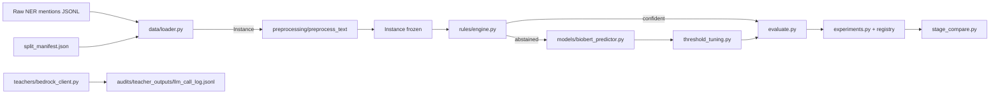
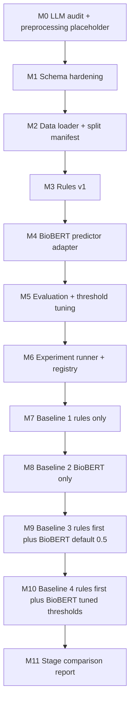

# PhenoContext: Data Contracts, Rules, Baselines, and Audit Plan

## Status snapshot

Already in place from the environment plan:
- Schema dataclasses in [src/ods_phenocontext/schema.py](src/ods_phenocontext/schema.py)
- Pipeline skeleton in [src/ods_phenocontext/pipeline.py](src/ods_phenocontext/pipeline.py)
- BioBERT module stub in [src/ods_phenocontext/models/biobert.py](src/ods_phenocontext/models/biobert.py)
- Bedrock teacher client in [src/ods_phenocontext/teachers/bedrock_client.py](src/ods_phenocontext/teachers/bedrock_client.py)
- Smoke + environment + pipeline tests under `tests/`

Known gap that this plan also fixes: [src/ods_phenocontext/pipeline.py](src/ods_phenocontext/pipeline.py) calls `biobert_model.predict_proba(instance)`, but `BioBERTMultiLabel.predict_proba` in [src/ods_phenocontext/models/biobert.py](src/ods_phenocontext/models/biobert.py) takes raw tensors, not an `Instance`. M4 introduces a `BioBERTPredictor` adapter that closes this gap.

## Key Decisions (locked in)

- **LLM call audit is universal.** Every Bedrock call goes through an instrumented `ChatBedrock` (LangChain callback + Pydantic record). No code path may construct a teacher without it. Records are appended JSONL to `audits/teacher_outputs/llm_call_log.jsonl`.
- **Cost is computed locally.** USD is derived from a static `model_id -> {input_per_1k, output_per_1k}` price table in `src/ods_phenocontext/audit/pricing.py`. Bedrock list prices change rarely; the table is versioned with a `priced_on` date and re-checked at each iteration boundary.
- **Preprocessing is a placeholder.** `src/ods_phenocontext/preprocessing/__init__.py` ships a pass-through `preprocess_text(text)` and a `Preprocessor` Protocol. Ingestion calls it once at instance construction. When the real scripts arrive from the other repo, replace the body — no other call sites change.
- **Preprocessing is applied once, at ingestion.** The canonical `Instance.context_window` is post-preprocessing. Inference does not re-preprocess. Production-time NER -> Instance construction also goes through the same factory.
- **No threshold tuning on test.** A guard in `threshold_tuning.py` asserts the input split is `"val"`. Frozen test usage is gated to the final reporting phase only.
- **Manifests are JSON, not SQLite.** Aligns with the audit-as-files style already in `audits/`. Fast to grep, easy to diff.
- **All four baselines reuse the same evaluator and the same val split.** Comparability beats novelty.

## Data Flow



## Milestone Map



Each milestone ends with a single checkpoint command and a deliverable.

---

### M0 — LLM audit instrumentation + preprocessing placeholder

**Why first:** these are cross-cutting. Every later milestone depends on them being stable.

- New module `src/ods_phenocontext/audit/`:
  - `pricing.py` — static dict `BEDROCK_PRICING` keyed by `model_id`; values `{"input_per_1k": float, "output_per_1k": float, "priced_on": "YYYY-MM-DD"}`. Function `compute_usd(model_id, input_tokens, output_tokens) -> float`.
  - `llm_calls.py` — `LLMCallRecord` Pydantic model (timestamp, model_id, region, teacher_role, prompt_tokens, completion_tokens, total_tokens, latency_ms, usd_cost, request_id, prompt_version, instance_id) and a LangChain `BaseCallbackHandler` subclass `LLMCostLogger` that writes one JSON line per `on_llm_end` to `audits/teacher_outputs/llm_call_log.jsonl`. Uses `response_metadata["usage"]` from `langchain-aws` (input_tokens / output_tokens / total_tokens).
  - `summarize_costs.py` — small CLI: `uv run python -m ods_phenocontext.audit.summarize_costs --since YYYY-MM-DD [--by role|model]` reads the JSONL log and prints totals.
- Wire the callback into [src/ods_phenocontext/teachers/bedrock_client.py](src/ods_phenocontext/teachers/bedrock_client.py) by attaching `LLMCostLogger` via the `callbacks=[...]` argument inside `build_teacher`. The callback is added unconditionally; the only way to bypass it is to construct `ChatBedrock` directly outside this module, which is forbidden by convention (note in `docs/decision_log.md`).
- ~~New module `src/ods_phenocontext/preprocessing/__init__.py`~~ — **dropped**. Text arrives pre-processed from the upstream NER pipeline and requires no further normalization. See `docs/decision_log.md`.
- **Checkpoint (completed):**

```bash
uv run pytest tests/test_audit_llm_calls.py -v
```

Tests assert: (a) a fake `LLMResult` with usage metadata yields the expected `LLMCallRecord` JSONL line and a non-zero `usd_cost`; (b) `summarize_costs` over a synthetic JSONL produces expected totals.

### M1 — Schema hardening

- Extend [src/ods_phenocontext/schema.py](src/ods_phenocontext/schema.py):
  - Add `Instance.__post_init__` validating: `len(gold_labels) == NUM_LABELS` when set; same for `rule_labels`, `rule_probs`, `biobert_probs`, `biobert_labels`; `split in {"train","val","test","production"}`; `source_type in {"original","synthetic","silver"}`; `parent_instance_id` required iff `source_type != "original"`.
  - Add `Instance.from_raw(instance_id, note_id, entity_text, context_window, split, **kwargs)` factory. No `preprocessor` argument — text is canonical on arrival (see `docs/decision_log.md`).
  - Add `Instance.to_dict() / Instance.from_dict()` (JSONL-friendly, no torch types).
  - Same `to_dict / from_dict` for `SyntheticAudit` and `TrainingManifest`.
- New `tests/test_schema_validation.py`: bad label length raises; bad split raises; synthetic without parent raises; round-trip equality through `to_dict -> json -> from_dict`.
- **Checkpoint:**

```bash
uv run pytest tests/test_schema.py tests/test_schema_validation.py -v
```

### M2 — Data loader + split manifest

- New module `src/ods_phenocontext/data/`:
  - `split_manifest.py` — read/write a JSONL manifest with rows `{instance_id, note_id, split, date_assigned, exclusion_reason}`. Constraint: a `note_id` may not appear under more than one split (enforced at load).
  - `loader.py` — function `load_instances(input_jsonl: Path, manifest: Path, preprocessor: Preprocessor = preprocess_text) -> Iterator[Instance]`. Drops any row whose `instance_id` is missing from the manifest or whose manifest row has a non-empty `exclusion_reason`. Uses `Instance.from_raw` so preprocessing is applied exactly once.
  - `__main__.py` — Click CLI: `uv run python -m ods_phenocontext.data --input data/gold/raw.jsonl --manifest data/gold/split_manifest.jsonl --out data/processed/instances.jsonl`. The CLI logs counts (per split, per source) but never logs raw text.
- Documentation: add `docs/label_ontology.md` (the four labels from `PROJECT_OVERVIEW.md` §First-Iteration Label Scope, with inclusion/exclusion bullets) and `docs/data_split_manifest.md` (format spec + how to add an exclusion).
- New `tests/test_data_loader.py`: synthetic JSONL fixture in `tests/fixtures/instances_mini.jsonl` (no PHI, fully fabricated mentions) and a tiny manifest. Asserts: correct count loaded, exclusions honored, note_id never crosses splits, preprocessor invoked exactly once per instance.
- **Checkpoint:**

```bash
uv run pytest tests/test_data_loader.py -v
```

### M3 — Rules v1

- New `rules/rules_v1.yaml` with four rule families (each entry has `id`, `target_label`, `pattern_type`, `pattern`, `confidence`, `version`):
  - Negation triggers (`negated`): "no", "denies", "without evidence of", "rules out", "negative for".
  - Family / experiencer (`associated_with_someone_else`): "mother", "father", "brother", "sister", "family history of".
  - Hypothetical / screening / uncertain (`other_non_patient`): "if", "consider", "screen for", "rule out" (when not paired with a present finding), "concerning for".
  - Confirmed history (`confirmed`): "history of <PHENO>", "diagnosed with <PHENO>", "<PHENO> on exam".
- New module `src/ods_phenocontext/rules/engine.py`:
  - `class RuleEngine` loads YAML, exposes `__call__(instance: Instance) -> dict[abstained, labels, probs, rule_ids]` — the contract already declared in `RulesModel` Protocol in [src/ods_phenocontext/pipeline.py](src/ods_phenocontext/pipeline.py).
  - Confidence scores per rule family are heuristic for now (0.90 to 0.95) and stamped with `version: "v1.0"`. Per `CLAUDE.md`, scores are explicitly labeled "heuristic confidence" until empirical PPV is computed in a later iteration.
- New `docs/rule_manifest.md` listing every rule_id, target label, pattern, score, score derivation method, and version. Updated whenever rules YAML changes.
- New `tests/test_rules_engine.py`: each rule family has at least one synthetic positive example and one out-of-scope example that triggers abstention; `rule_ids` reflect what fired; rule output shape matches the `RulesModel` Protocol.
- **Checkpoint:**

```bash
uv run pytest tests/test_rules_engine.py -v
```

### M4 — BioBERT inference adapter

- New `src/ods_phenocontext/models/biobert_predictor.py`:
  - `class BioBERTPredictor` holds an `AutoTokenizer` + `BioBERTMultiLabel`. Has `predict_proba(instance: Instance) -> list[float]` (matches the `BioBERTModel` Protocol in pipeline.py) and `predict(instance, thresholds) -> list[int]`.
  - Constructor takes `model_path` (HF id or local checkpoint dir) and `max_length: int = 256`.
  - Does NOT re-apply preprocessing; trusts that `instance.context_window` is canonical.
- Update `src/ods_phenocontext/models/__init__.py` to export both `BioBERTMultiLabel` and `BioBERTPredictor`.
- New `tests/test_biobert_predictor.py`: instantiate with `dmis-lab/biobert-base-cased-v1.2` (already cached by the existing environment test), run a forward pass on a synthetic Instance, verify probs length and range, verify pipeline integration: `phenocontext_predict` runs end-to-end on a synthetic abstain case using a real predictor.
- **Checkpoint:**

```bash
uv run pytest tests/test_biobert_predictor.py tests/test_pipeline_smoke.py -v
```

### M5 — Evaluation + threshold tuning

- New `src/ods_phenocontext/evaluate.py`:
  - `compute_metrics(predictions: list[Instance], gold: list[Instance]) -> dict` returning per-label P/R/F1, micro/macro F1, PR-AUC where computable, source coverage (rules vs biobert vs neither), and per-label confusion counts.
  - `slice_metrics(predictions, slice_fn)` for note_type / department / context-length slicing later.
- New `src/ods_phenocontext/threshold_tuning.py`:
  - `tune_thresholds(probs_matrix, gold_matrix, split: str, objective: str = "f1") -> dict[label_name, float]`. Asserts `split == "val"` — explicit error otherwise.
  - Sweeps thresholds in `[0.05, 0.95]` step 0.01 per label independently (multi-label); selects per-label optimum. Writes `audits/thresholds_v<n>.json` with `{label_name: threshold, objective, val_metrics}`.
- New `tests/test_evaluate.py` and `tests/test_threshold_tuning.py`: known synthetic predictions yield expected metrics; threshold tuner picks the threshold that maximizes the objective on a synthetic distribution; passing `split="test"` raises.
- **Checkpoint:**

```bash
uv run pytest tests/test_evaluate.py tests/test_threshold_tuning.py -v
```

### M6 — Experiment runner + registry

- New `src/ods_phenocontext/experiments.py`:
  - `class ExperimentRun` holds config (rules version, model checkpoint, thresholds path, val split id, source counts).
  - `run_experiment(name: str, run: ExperimentRun) -> Path` writes `experiments/<name>/{predictions.jsonl, metrics.json, manifest.json}` and appends a row to `docs/experiment_registry.md` with timestamp, name, key metrics, and links to artifacts.
- The manifest written here is a `TrainingManifest` instance (already defined in [src/ods_phenocontext/schema.py](src/ods_phenocontext/schema.py)); for inference-only baselines, training-specific fields are populated as `iteration=0, num_synthetic=0, num_silver=0, synthetic_ratio=0.0, teacher_models=[], teacher_weights={}`.
- New `tests/test_experiments.py`: a fake `ExperimentRun` produces the expected directory layout and registry row; rerunning with the same name updates rather than duplicates the row.
- **Checkpoint:**

```bash
uv run pytest tests/test_experiments.py -v
```

### M7 — Baseline 1: rules only

- New entrypoint `experiments/baseline_rules/run.py` (or a Click subcommand under `src/ods_phenocontext/experiments.py`).
- Loads val instances, runs `RuleEngine`, treats abstentions as no-prediction `[0,0,0,0]`, computes metrics, writes artifacts.
- Captures: per-label P/R/F1, abstention rate, rule_id frequency, coverage.
- **Checkpoint:**

```bash
uv run python -m ods_phenocontext.experiments run --name baseline_rules --stage rules_only
uv run pytest tests/test_baseline_rules.py -v
```

Test runs the experiment over a synthetic val fixture and asserts artifacts exist and metric values match expectations on the fixture.

### M8 — Baseline 2: BioBERT only

- Same entrypoint, `--stage biobert_only`. Uses uniform 0.5 threshold per label (per-label tuning is M10).
- Artifacts: `experiments/baseline_biobert/`.
- **Checkpoint:**

```bash
uv run python -m ods_phenocontext.experiments run --name baseline_biobert --stage biobert_only
uv run pytest tests/test_baseline_biobert.py -v
```

Test uses the cached `dmis-lab/biobert-base-cased-v1.2` checkpoint and the same val fixture; asserts artifacts and shape, not specific metric values (untrained model -> arbitrary numbers; we check structure only).

### M9 — Baseline 3: rules first + BioBERT fallback (default 0.5)

- Same entrypoint, `--stage rules_then_biobert_default`. Wires `phenocontext_predict` from [src/ods_phenocontext/pipeline.py](src/ods_phenocontext/pipeline.py).
- Adds per-source coverage metrics (% predicted by rules vs BioBERT) to `metrics.json`.
- **Checkpoint:**

```bash
uv run python -m ods_phenocontext.experiments run --name baseline_rules_then_biobert --stage rules_then_biobert_default
uv run pytest tests/test_baseline_rules_then_biobert.py -v
```

Test asserts source distribution on a synthetic mix of rule-confident and rule-abstain instances matches expected.

### M10 — Baseline 4: rules first + BioBERT fallback + tuned thresholds

- Run `tune_thresholds` on val (M5), save `audits/thresholds_v1.json`, re-run pipeline with those thresholds.
- Same entrypoint, `--stage rules_then_biobert_tuned --thresholds audits/thresholds_v1.json`.
- The same val split is used for tuning and reporting in this iteration; document this honestly in the registry (per `CLAUDE.md`: "Do not tune thresholds then evaluate on the same data in the same pass" — so for the manuscript-grade comparison, future iterations will reserve a held-out tuning subset). Add this as a known limitation in `docs/decision_log.md`.
- **Checkpoint:**

```bash
uv run python -m ods_phenocontext.threshold_tuning --predictions experiments/baseline_biobert/predictions.jsonl --out audits/thresholds_v1.json
uv run python -m ods_phenocontext.experiments run --name baseline_rules_then_biobert_tuned --stage rules_then_biobert_tuned --thresholds audits/thresholds_v1.json
uv run pytest tests/test_baseline_rules_then_biobert_tuned.py -v
```

### M11 — Stage comparison report

- New `src/ods_phenocontext/stage_compare.py`:
  - `compare_stages(stage_dirs: list[Path], out_md: Path)` reads `metrics.json` from each baseline and writes a markdown comparison: per-label P/R/F1 deltas, micro/macro F1 deltas, source-coverage shifts, and a "what changed" column linking back to each stage's manifest.
  - First report path: `experiments/stage_comparison_v1.md`.
- Update `docs/experiment_registry.md` with a top-level "Iteration 0 baselines" section pointing to the four baseline runs and the comparison report.
- **Checkpoint:**

```bash
uv run python -m ods_phenocontext.stage_compare --stages experiments/baseline_rules experiments/baseline_biobert experiments/baseline_rules_then_biobert experiments/baseline_rules_then_biobert_tuned --out experiments/stage_comparison_v1.md
uv run pytest tests/test_stage_compare.py -v
test -s experiments/stage_comparison_v1.md
```

---

## Final state verification

After M11, this single command should be the contract that the development pipeline is healthy:

```bash
uv run pytest \
  && uv run ruff check . \
  && uv run mypy src \
  && uv run python -m ods_phenocontext.experiments run --name baseline_rules --stage rules_only \
  && uv run python -m ods_phenocontext.experiments run --name baseline_biobert --stage biobert_only \
  && uv run python -m ods_phenocontext.experiments run --name baseline_rules_then_biobert --stage rules_then_biobert_default \
  && uv run python -m ods_phenocontext.experiments run --name baseline_rules_then_biobert_tuned --stage rules_then_biobert_tuned --thresholds audits/thresholds_v1.json \
  && uv run python -m ods_phenocontext.stage_compare --out experiments/stage_comparison_v1.md
```

The four baselines, their manifests, the comparison report, and a populated `audits/teacher_outputs/llm_call_log.jsonl` (empty until any teacher call is made) are then ready for the modeling roadmap's Phase 3 (run teacher committee on targeted cases).

## Out of scope for this plan

Per `PROJECT_OVERVIEW.md` boundaries and the user's "then baselines" cutoff:

- Teacher committee invocation on discordant cases, aggregation, and silver labels (modeling roadmap Phase 3-5). The infrastructure is ready (instrumented client + cost log) but the workflows themselves are deferred.
- Synthetic generation, validation, and retraining (Phase 6-9).
- Test-set evaluation (Phase 13). The test split is loaded but never read by any code in this plan.
- Docker / deployment image — already covered by the environment plan's M11.
- Internal preprocessing standards content — placeholder only; user will drop in real implementations.

## Open hooks (drop-in points)

- `src/ods_phenocontext/preprocessing/__init__.py`: replace `preprocess_text` body with internal standards from the user's other repo. Loader and predictor will pick it up automatically.
- `audits/thresholds_v1.json`: regenerated whenever rules or BioBERT change; M10 documents the shape.
- `src/ods_phenocontext/audit/pricing.py`: refresh `BEDROCK_PRICING` table at each iteration boundary (record `priced_on` date).
