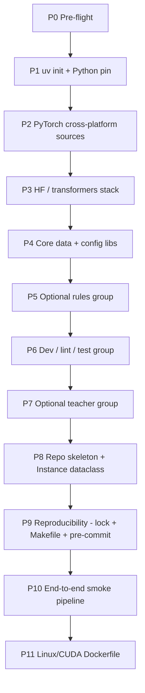

# uv-Managed Python Environment Setup Plan

## Key Decisions (locked in)

- **Package manager:** `uv` (single source of truth for Python version, deps, and lockfile).
- **Python:** `3.11` pinned via `.python-version`; declared as `requires-python = ">=3.11,<3.12"` in `pyproject.toml`.
- **Cross-platform torch:** PyPI default on macOS (CPU + MPS); CUDA wheel index on Linux. Configured via `[tool.uv.sources]` + `[[tool.uv.index]]` per the official uv guide.
- **Dependency groups (PEP 735):** keep production runtime lean.
  - `default` (runtime): torch, transformers, sklearn, numpy, pandas, pyyaml, pydantic, click, tqdm.
  - `rules` (optional extra): spaCy stack for richer rule features.
  - `dev`: pytest, pytest-cov, ruff, mypy, pre-commit, ipython.
  - `teacher` (development-only): `langchain`, `langchain-core`, `langchain-aws`, `boto3`, `tenacity`, `python-dotenv`. **All LLM calls go through AWS Bedrock via LangChain** (`langchain_aws.ChatBedrock`) — single auth path (AWS IAM) and single audit surface; no direct OpenAI/Anthropic SDKs. **Not** installed in the production Docker image, per `PROJECT_OVERVIEW.md` "LLMs are dev-only".
- **HIPAA discipline from day one:** `data/` is gitignored; tests use only synthetic strings; no raw note text in logs.

## Phase Map



Each phase ships one or two concrete edits and a single checkpoint command that must exit 0 before moving on.

---

### Phase 0 — Pre-flight

- Confirm `uv --version` (install via Homebrew or `curl -LsSf https://astral.sh/uv/install.sh | sh` if missing).
- `git init`, add a minimal `.gitignore` covering: `.venv/`, `__pycache__/`, `*.pyc`, `data/`, `models/`, `audits/`, `.env`, `.ruff_cache/`, `.mypy_cache/`, `.pytest_cache/`, `*.ipynb_checkpoints`.
- **Checkpoint:** `uv --version && git status` exits 0 and `.gitignore` contains `data/` and `.env`.

### Phase 1 — `uv init` and Python pin

- `uv init --package --no-readme --python 3.11 .` to create `pyproject.toml`, `.python-version`, and `src/ods_phenocontext/__init__.py`.
- Set `[project] name = "ods-phenocontext"`, `requires-python = ">=3.11,<3.12"`.
- **Checkpoint:**

```bash
uv sync && uv run python -c "import sys; assert sys.version_info[:2] == (3, 11)"
```

### Phase 2 — Cross-platform PyTorch

Add to `pyproject.toml` (uv guide pattern, confirmed for sys_platform markers):

```toml
[project]
dependencies = ["torch>=2.4,<2.6"]

[[tool.uv.index]]
name = "pytorch-cu124"
url = "https://download.pytorch.org/whl/cu124"
explicit = true

[tool.uv.sources]
torch = [
  { index = "pytorch-cu124", marker = "sys_platform == 'linux'" },
]
```

- macOS resolves `torch` from PyPI (MPS-capable wheel); Linux pulls from the CUDA index when the lockfile is regenerated there.
- **Checkpoint (mac):**

```bash
uv run python -c "import torch; print(torch.__version__, torch.backends.mps.is_available())"
```

Expect a torch version and `True` on MPS-capable Macs. Defer CUDA verification until the Docker build in Phase 11.

### Phase 3 — Hugging Face / transformers stack

- `uv add transformers tokenizers accelerate safetensors huggingface_hub`.
- Add `datasets` only if used (safe to defer; it pulls many transitive deps).
- **Checkpoint:** load a tiny model that won't bloat CI:

```bash
uv run python -c "from transformers import AutoTokenizer; AutoTokenizer.from_pretrained('prajjwal1/bert-tiny')"
```

### Phase 4 — Core data and config libraries

- `uv add numpy pandas scikit-learn pyyaml pydantic click tqdm`.
- These power the `Instance` dataclass, threshold tuning, rule YAML parsing, CLI entrypoints.
- **Checkpoint:** single import sanity script:

```bash
uv run python -c "import numpy, pandas, sklearn, yaml, pydantic, click, tqdm; print('ok')"
```

### Phase 5 — Rules group (optional extra)

- `uv add --optional rules spacy`.
- Hold off on `medspacy` until Phase 8/9 of the *modeling* roadmap actually needs ConText/Negex; revisit then. Document this in `docs/decision_log.md`.
- **Checkpoint:**

```bash
uv sync --extra rules
uv run python -c "import spacy; print(spacy.__version__)"
```

### Phase 6 — Dev / lint / test group

- `uv add --group dev pytest pytest-cov ruff mypy pre-commit ipython`.
- Configure in `pyproject.toml`:
  - `[tool.ruff]` line length 100, target Python 3.11, enable `E,F,I,B,UP,SIM`.
  - `[tool.mypy]` `python_version = "3.11"`, `strict_optional = true`, `ignore_missing_imports = true` (HF stubs are spotty).
  - `[tool.pytest.ini_options]` `testpaths = ["tests"]`, `addopts = "-q --strict-markers"`.
- **Checkpoint:** add a trivial `tests/test_smoke.py` that asserts `1 + 1 == 2`, then:

```bash
uv run pytest && uv run ruff check . && uv run mypy src
```

All three must pass.

### Phase 7 — Teacher group (development-only, AWS Bedrock via LangChain)

- All teacher LLM calls go through **AWS Bedrock** using `langchain_aws.ChatBedrock`. No direct OpenAI/Anthropic SDK usage. The committee from `PROJECT_OVERVIEW.md` (generalist, precision-biased, recall-biased, optional mechanistic) becomes four LangChain runnables, each pointed at a Bedrock `model_id` (e.g. Claude family) and given a different system prompt + temperature.
- `uv add --group teacher langchain langchain-core langchain-aws boto3 tenacity python-dotenv`.
- These imports must **never** be required at production import time; gate them behind `try/except ImportError` inside `src/ods_phenocontext/teachers/`.
- **Credentials:** rely on the boto3 default credential chain (env vars, `~/.aws/credentials`, IAM role). Commit `.env.example` documenting `AWS_REGION` and `AWS_PROFILE` placeholders only — never commit real keys. Per `CLAUDE.md`, `.env` stays gitignored.
- **AWS-side prerequisite:** Bedrock model access must be explicitly granted per region in the AWS console before any call. Record the enabled `model_id`s and region in `docs/decision_log.md` and in the `prompt_registry`.
- **Structured output:** use LangChain's `with_structured_output(schema)` against a Pydantic model that mirrors the teacher contract from `PROJECT_OVERVIEW.md` (`labels: list[int]`, `rationale: str`, `evidence_spans: list[str]`, `confidence_bin: Literal["high","medium","low"]`).
- **Checkpoint:** teacher group is opt-in, runtime excludes it, and a no-network construction smoke test passes:

```bash
uv sync                                # default install: no langchain/boto3
uv run python -c "import langchain_aws" && echo FAIL || echo "ok: teacher group correctly excluded"
uv sync --group dev --group teacher
uv run python -c "from langchain_aws import ChatBedrock; ChatBedrock(model_id='anthropic.claude-3-5-sonnet-20241022-v2:0', region_name='us-east-1'); print('teachers ok')"
```

The construction step does **not** invoke Bedrock — it only verifies the package, transitive `boto3`, and the class are importable. A real round-trip belongs in `tests/integration/test_bedrock_live.py`, skipped unless `RUN_BEDROCK_INTEGRATION=1` is set.

### Phase 8 — Repository skeleton + `Instance` dataclass

Materialize the layout from `PROJECT_OVERVIEW.md` (sections 612–660 and `CLAUDE.md`):

```text
src/ods_phenocontext/
  __init__.py
  schema.py          # Instance, SyntheticAudit, TrainingManifest dataclasses
  rules/__init__.py  # placeholder; real rules loaded from rules/*.yaml
  models/__init__.py # BioBERTMultiLabel placeholder
  teachers/
    __init__.py
    bedrock_client.py  # thin wrapper around langchain_aws.ChatBedrock + structured-output Pydantic schema (lazy import; gated behind ImportError)
  pipeline.py        # phenocontext_predict skeleton from PROJECT_OVERVIEW.md
configs/
prompts/
rules/
data/{gold,silver,synthetic,processed}/.gitkeep
audits/{teacher_outputs,synthetic_provenance,training_manifests}/.gitkeep
docs/{label_ontology.md,decision_log.md,rule_manifest.md,experiment_registry.md}
tests/
  test_schema.py
  test_pipeline_smoke.py
```

- Copy the `Instance` dataclass verbatim from `PROJECT_OVERVIEW.md` lines 84–108 into `src/ods_phenocontext/schema.py`.
- Stub `phenocontext_predict` from `PROJECT_OVERVIEW.md` lines 132–151 in `pipeline.py`, with a fake rules-model fixture for the test.
- **Checkpoint:** `tests/test_schema.py` round-trips an `Instance` and `tests/test_pipeline_smoke.py` exercises both branches (rule confident, rule abstain → biobert stub):

```bash
uv run pytest -q
```

### Phase 9 — Reproducibility scaffolding

- Commit `uv.lock` (uv generates it; it pins resolved versions per platform).
- Add a `Makefile` with `setup`, `test`, `lint`, `format`, `typecheck`, `dev`, `lock` targets — single source of truth for contributor commands.
- Add `.pre-commit-config.yaml` running `ruff check --fix`, `ruff format`, and an `end-of-file-fixer`. Install with `uv run pre-commit install`.
- Update `README.md` with `uv sync --group dev` quickstart and the HIPAA / data-handling note from `CLAUDE.md`.
- **Checkpoint:** clean-clone simulation —

```bash
rm -rf .venv && uv sync --group dev --group teacher --extra rules
uv run pre-commit run --all-files
make test   # or: uv run pytest
```

Lockfile must not be modified by `uv sync` (i.e., `git diff uv.lock` is empty).

### Phase 10 — End-to-end smoke pipeline test

- Add `tests/test_environment.py` that asserts:
  - Python is 3.11.
  - `torch` imports and reports a usable device (`mps` on Mac, `cuda` or `cpu` elsewhere).
  - `transformers.AutoModel.from_pretrained("prajjwal1/bert-tiny")` runs a forward pass on a 4-token batch and returns hidden states of the expected shape.
  - The placeholder `BioBERTMultiLabel(num_labels=4)` from Phase 8 produces logits of shape `(1, 4)`.
- This is the contract: if any phase regresses, this test fails.
- **Checkpoint:** `uv run pytest tests/test_environment.py -v` passes on macOS.

### Phase 11 — Linux/CUDA Dockerfile

- Multi-stage Dockerfile based on `nvidia/cuda:12.4.1-runtime-ubuntu22.04` (matches the `cu124` index from Phase 2):
  - Stage 1: `astral-sh/uv` builder image; `uv sync --frozen --no-dev --no-group teacher` to install runtime-only deps.
  - Stage 2: copy `.venv` and `src/` into the runtime image; set `PATH=/app/.venv/bin:$PATH`.
- `.dockerignore` mirrors `.gitignore` and additionally excludes `tests/`, `notebooks/`, `data/`.
- The production image deliberately excludes the `teacher` group, so it has **no** `langchain`, `langchain-aws`, or `boto3`, and needs **no** AWS credentials. Teacher / refresh workflows run from a separate dev environment (or a separate scheduled job image) with AWS IAM access to Bedrock.
- **Checkpoint:** `docker build -t ods-phenocontext:dev .` succeeds, and `docker run --rm ods-phenocontext:dev python -c "import torch; print(torch.cuda.is_available())"` runs (returns `False` locally without a GPU, `True` on the deployment host — both are acceptable; the assertion is that import does not fail and the container starts). Additionally verify the teacher stack is absent: `docker run --rm ods-phenocontext:dev python -c "import langchain_aws"` must fail with `ModuleNotFoundError`.

---

## Final State Verification

After Phase 11, this single command on a fresh clone is the contract that the environment is healthy:

```bash
uv sync --group dev --group teacher --extra rules \
  && uv run pytest \
  && uv run ruff check . \
  && uv run mypy src \
  && docker build -t ods-phenocontext:dev .
```

If that pipeline is green, the environment is ready for Phase 1 (Freeze Gold Splits) of the modeling roadmap in `PROJECT_OVERVIEW.md`.

## What is intentionally deferred

- `medspacy`, `negspacy`, `mlflow`, `wandb`, `datasets`: add when the corresponding modeling phase needs them, with a one-line entry in `docs/decision_log.md`.
- A learned router / stacked ensemble: forbidden by `CLAUDE.md` until validation evidence justifies it.
- CI (GitHub Actions): out of scope for this plan; the Makefile + pre-commit cover local enforcement. Add CI as a follow-up plan once the repo is private/cleared for clinical metadata exposure.
